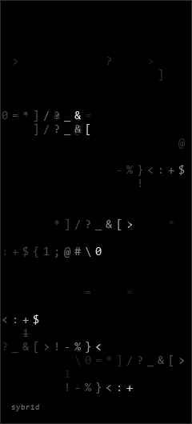

<table>
  <tr>
    <td width="280" valign="top">
      
    </td>
    <td valign="top">
      <pre><code>sybr1d@github:~$ whoami
security researcher
ethical hacker
vulnerability research
exploit development
responsible disclosure

</code></pre>

      

        <a href="https://x.com/sybr1d_">x.com/sybr1d_</a> /
        <a href="https://gitlab.com/rafabd">gitlab.com/rafabd</a> /
        <a href="https://app.hackthebox.com/users/2216017">hackthebox</a> /
        <a href="https://hackerone.com/rafabd1">hackerone</a>
      

      

        <strong>published advisories</strong> 
        <a href="https://www.cve.org/CVERecord?id=CVE-2026-1282">CVE-2026-1282</a> /
        <a href="https://github.com/advisories/GHSA-hgv7-v322-mmgr">GHSA-hgv7-v322-mmgr</a>
      

    </td>
  </tr>
</table>

  
telemetry

   

  
  

